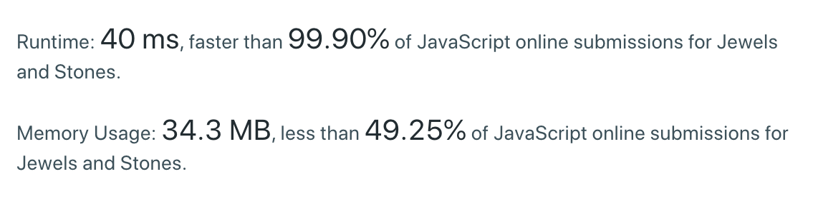

###### tags：
You're given strings J representing the types of stones that are jewels, and S representing the stones you have.  Each character in S is a type of stone you have.  You want to know how many of the stones you have are also jewels.

The letters in J are guaranteed distinct, and all characters in J and S are letters. Letters are case sensitive, so "a" is considered a different type of stone from "A".

Example 1:
```
Input: J = "aA", S = "aAAbbbb"
Output: 3
```
Example 2:
```
Input: J = "z", S = "ZZ"
Output: 0
```
Note:

* S and J will consist of letters and have length at most 50.
* The characters in J are distinct.

## 題目

給予兩個陣列，第一個陣列代表 jewel，只要是存在這陣列的 char 都是 jewels，第二個陣列代表 stones，stones 中可能存在 jewel ，請找出在 stones 中有幾個jewel。

## 思路
找出 stones 的 stone 有哪些是 jewel ，所以 stones 遍歷一次是必然的，使用 stone 去 尋找是否存在於 jewel 即可。

* 取出 stone(forEach、reduce)
* 計算 stone 是否存在 jewl
  * 是就加1

### 解答

#### 使用 Array.Index & reduce

```javascript
var numJewelsInStones = function (J, S) {
  return S.split('').reduce((jewelsTotal, stone) => {
    return J.indexOf(stone) !== -1 ? (jewelsTotal + 1) : jewelsTotal;
  }, 0);
};
```


* `Time Complexity`：`O(n²)`
* `Space Complexity`：`O(2N)` 

#### 使用 Set & reduce

```javascript
var numJewelsInStones = function (J, S) {
  const jewels = new Set(J)
    return S.split('').reduce((res, s) => res + jewels.has(s), 0)
};
```

#### 使用 Set & filter &  spread operator

```javascript
return [...S].filter((char) => J.indexOf(char) > -1 ).length
```


