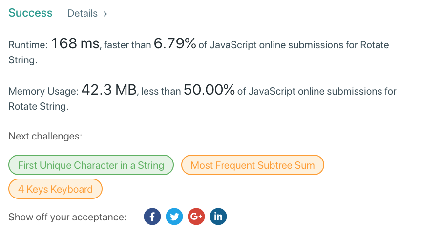
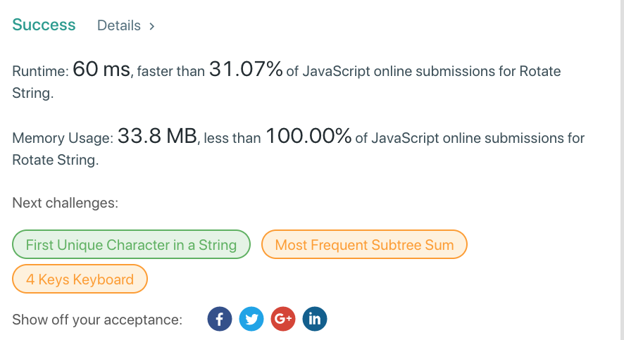
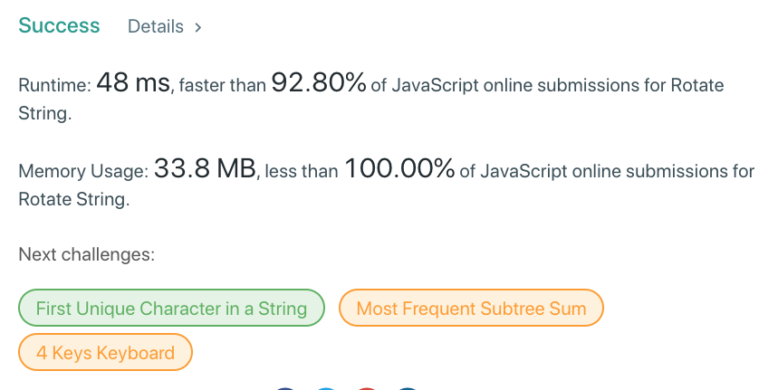

###### tags：`Array`、`HashTable`
# solution

## 題目

定義一個函式，其參數為兩個字串，當第一個字串可以將最後一個 char 移到最前面，而跟第二個字串一樣時，則返回 `true`

## 流程
* 比對字串

## Queue
將字串轉換成 Array，然後使用 `enqueue(dequeue)` 一一比對。 

* `Time Complexity`：`O(n)`
* `Space Complexity`：`O(1)`

## Simple Check

所有的輪轉都必然跟 `A` + `A` 一樣，所以將第一個字串再重複拼起來一遍，必用 B 字串去搜尋即可。

* `Time Complexity`：`O(n²)`
* `Space Complexity`：`O(2N)` 
### first

### better
.png)

## Previous&Next

使用迴圈逐步計算，每一次都用 index 來切 A 字串成兩半

* 前半個字串用 `index` 判斷以及起始位置是否等同於A字串長度減掉pre字串長度
* 後半個字串來比對用 `index` 判斷以及起始位置是否等於 0

