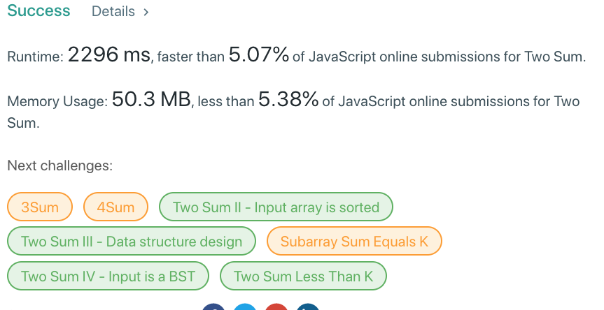

###### tags：`Array`、`HashTable`
# Two Sum
Given an array of integers, return **indices** of the two numbers such that they add up to a specific target.

You may assume that each input would have **exactly** one solution, and you may not use the same element twice.

Example:
```
Given nums = [2, 7, 11, 15], target = 9,

Because nums[0] + nums[1] = 2 + 7 = 9,
return [0, 1].
```

## 流程

* 迴圈取出每一個數字
* 使用此數字再加上剩餘的每一個數字，逐一比對是否與 `target` 相同。

## Brute Force 暴力破解

最簡單直接的計算，以兩個 for 迴圈計算，在第一個迴圈得到數值之後，排除此已經取得過的數值，將使用迴圈一一取得剩餘的數值比較。

* `Time Complexity`：`O(n²)`
* `Space Complexity`：`O(1)`
### JavaScript


## Map(JavaScript)

首先建立一個 `map` 物件的變數，再來使用一個 for 迴圈取出數值，每取出一個數值後，就減去 `Target` 取得 餘數，然後用此餘數去 `map` 物件尋找是否存在同樣 value 的屬性。

若沒有的話，就將此餘數儲存去 `map`，儲存的格式跟 `nums` 相反，原本的 `value` 作為 `key`，原本的 `key` 作為 `value`。

若有的話，則以此餘數為 map 的索引值，取得此數值在原本 `nums` 的索引值，然後回傳。
